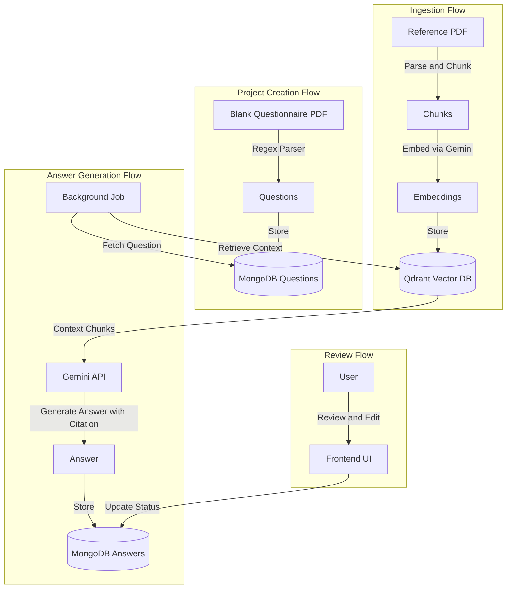
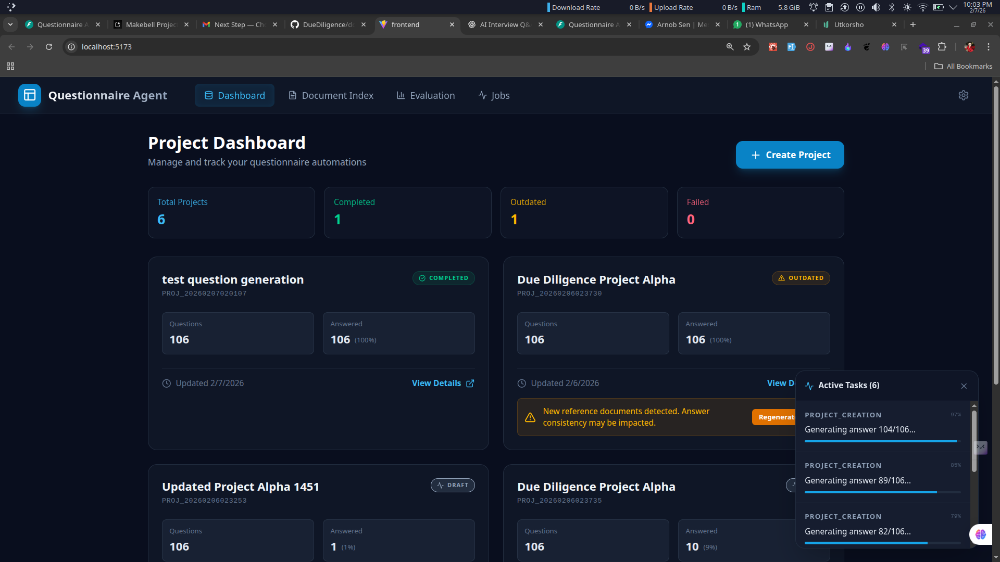
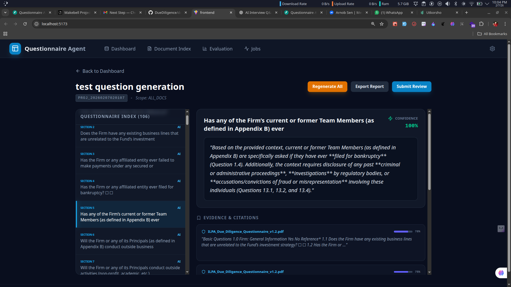
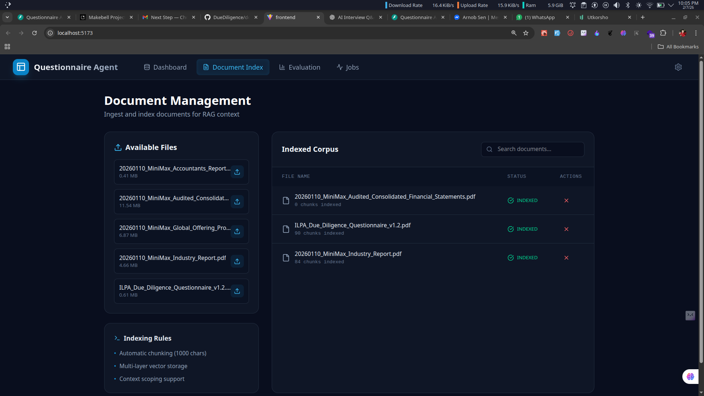

# Due Diligence Questionnaire Agent

A full-stack AI system to automate Due Diligence Questionnaires (DDQ). It ingests reference documents (PDFs), parses blank questionnaires, and utilizes a RAG (Retrieval-Augmented Generation) pipeline to generate answers with citations and confidence scores.


## 🚀 Key Features

- **Document Ingestion:** Parses PDFs, chunks text, and stores embeddings in Qdrant (Vector DB).
- **Smart Parsing:** Automatically extracts questions from blank questionnaire PDFs using Regex heuristics.
- **RAG Engine:** Generates answers using Google Gemini, backed by semantic search.
- **Citations & Confidence:** Every answer links back to specific document chunks with a confidence score.
- **Review Workflow:** Manual override capabilities for "Human-in-the-loop" review.
- **Evaluation Framework:** Benchmarks AI answers against Ground Truth using Cosine Similarity.
- **Reactive Updates:** Projects automatically mark as `OUTDATED` when new reference documents are indexed.

---

## 🛠️ Setup Instructions

### Prerequisites

- Python 3.10+
- Node.js 18+
- MongoDB (Local or Atlas)
- Qdrant (Local Docker or Cloud)
- Google Gemini API Key

### 1. Backend Setup

```bash
cd backend

# Create virtual environment
python -m venv venv
source venv/bin/activate  # or venv\Scripts\activate on Windows

# Install dependencies
pip install -r requirements.txt

# Configure Environment
# Create a .env file based on the example below:
# MONGO_URI=mongodb://localhost:27017
# QDRANT_URL=http://localhost:6333
# GOOGLE_API_KEY=your_gemini_key

# Run the Server
uvicorn src.main:app --reload
```

### 2. Frontend Setup

```bash
cd frontend

# Install dependencies
npm install

# Run the Interface
npm run dev
```

The UI will be available at http://localhost:5173.

## 🏗️ Architecture & Design

### System Overview

The system is designed as a decoupled full-stack application.

- **Frontend:** React (Vite) + TailwindCSS. Handles user interaction, project management, and manual review.
- **Backend:** FastAPI. Orchestrates the ingestion, parsing, and generation workflows.
- **Storage:**
  - **MongoDB:** Relational data (Projects, Questions, Answers, Job Status).
  - **Qdrant:** Vector embeddings for semantic retrieval.
- **AI Engine:** Google Gemini (via LangChain).

### Data Flow



### Functional Design

- **User Flows:** Users create projects by selecting a blank questionnaire and a scope of reference documents. The system asynchronously processes the questionnaire.
- **Status Transitions:**
  - **Projects:** `DRAFT` → `PROCESSING` → `COMPLETED` (or `OUTDATED` if new docs are added).
  - **Answers:** `AI_GENERATED` → `MANUAL_UPDATED` or `CONFIRMED`.
- **Edge Cases:**
  - **Empty Context:** If no relevant documents are found, the system returns "Not answerable" with low confidence.
  - **Google API Quotas:** Implemented tenacity retry logic with exponential backoff.

## 🧪 Testing & Evaluation Plan

### QA Checklist (Manual Verification)

To verify the system functionality against the spec, follow this sequence:

1.  **Ingestion Smoke Test:**
    - Upload `20260110_MiniMax_Accountants_Report.pdf` via the Indexing tab.
    - Verify it appears in the "Indexed Corpus" list with chunk count > 0.
2.  **Project Creation & Parsing:**
    - Go to Dashboard → "Create Project".
    - Select `ILPA_Due_Diligence_Questionnaire_v1.2.pdf`.
    - Verify project status moves from `PROCESSING` → `COMPLETED`.
    - Open Project Detail and verify questions were parsed correctly.
3.  **Answer Quality & Citations:**
    - Check generated answers.
    - **Requirement:** Verify every answer has a "Confidence Score" and at least one "Citation".
4.  **Outdated Logic Test (Critical Requirement):**
    - **Pre-condition:** Project status is `COMPLETED`.
    - **Action:** Go to Indexing tab and upload a new PDF (e.g., a second report).
    - **Result:** Go back to Dashboard. The Project status should now be `OUTDATED`.
    - **Recovery:** Click "Regenerate". Status should return to `COMPLETED`.

### Evaluation Framework

- **Methodology:** Cosine Similarity between AI Answer Vector and Ground Truth Vector.
- **Execution:**
  1.  Navigate to the Evaluation tab.
  2.  Select a completed project.
  3.  Click "Run Benchmark Simulation" (Simulates uploading a Ground Truth CSV).
  4.  View numeric accuracy scores and qualitative delta analysis.

## 📝 Notes & Tradeoffs

In building this skeleton, I prioritized architectural clarity and extensibility over complex edge-case handling.

- **Parsing Strategy (Heuristic vs. LayoutLM):**
  - **Decision:** I used a regex/heuristic-based parser (`parse.py`) to extract questions from the PDF.
  - **Tradeoff:** This is fast and works for standard "1.1 Question" formats but is brittle for complex layouts (tables/multicolumn).
  - **Future:** Replace with a layout-aware model (Microsoft LayoutLM) or a Vision-Language Model (Gemini 1.5 Pro) for robust parsing.

- **Async Handling (BackgroundTasks vs. Celery):**
  - **Decision:** Utilized FastAPI's built-in `BackgroundTasks`.
  - **Tradeoff:** Simplifies deployment (no Redis required) but lacks persistence if the server crashes during a job.
  - **Future:** Move to Celery + Redis for production-grade durability and retries.

- **Evaluation Metric (Embeddings vs. LLM Judge):**
  - **Decision:** Used Cosine Similarity on embeddings.
  - **Tradeoff:** Captures semantic overlap efficiently but misses nuances like "missing specific dates" or "wrong tone."
  - **Future:** Implement an "LLM Judge" layer where an AI explains why the score is low.

## 📸 Screenshots


_Dashboard showing projects and status_


_Project detail view with questions and answers_


_Document Management
Ingest and index documents for RAG context_
